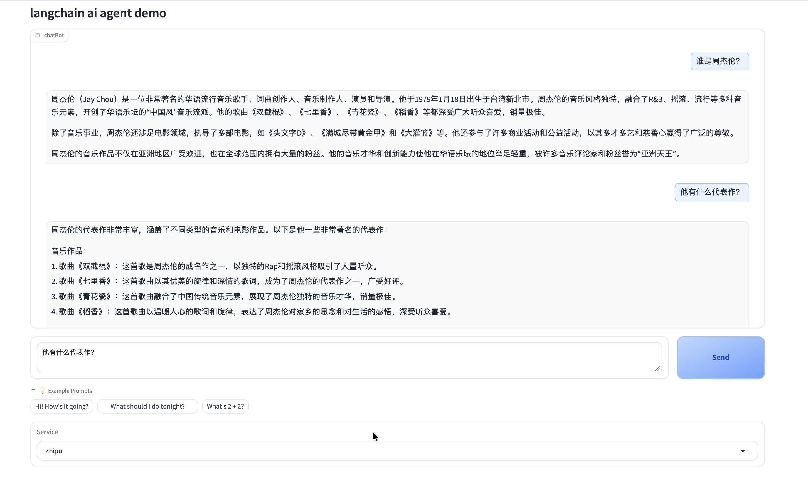

# 基于LangChain实现的Chat Agent


支持多种大语言模型（LLM）引擎的 Web 聊天界面，基于 Gradio 和 LangChain 实现，具备多轮记忆能力、动态配置 api key、自动加载模型等功能。

## 🔍 项目简介

- 支持多个 LLM 引擎（OpenAI、ZhipuAI……）可拓展
- 每个引擎支持独立 API Key 配置
- 使用 LangChain 构建的带记忆的对话链
- Gradio 界面支持动态切换引擎和保存配置
- 状态保持：记住上下文，支持多轮对话


## 🖥️ 界面展示
<p align="center">
  
</p>


## 🚀 快速启动

```bash
pip install gradio langchain langchain_community

python app.py
```


📮[choucisan@gmail.com]